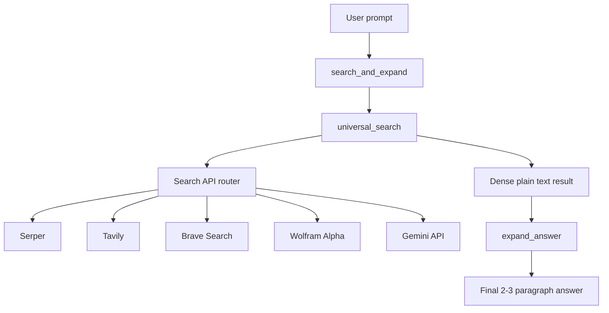

# Universal Search and Expand Bundle

A phone-safe Google AI Edge Gallery skill bundle that retrieves live information from the web, normalizes the results into a dense text block, and then rewrites that block into a clearer, fuller answer.

The bundle is organized as three skills:

- `search_and_expand` — orchestrates the two-step flow so the user can ask one prompt and get one final answer.
- `universal_search` — fetches and normalizes search results from one or more search APIs.
- `expand_answer` — rewrites the retrieved text into a direct, detailed answer.

## What this bundle does

This bundle is designed for on-device Gemma workflows where tool output needs to stay compact, grounded, and easy to expand. It keeps the retrieval step separate from the writing step, which helps the model produce richer answers without relying on a single large prompt.

Typical behavior:

1. The user asks a question.
2. `search_and_expand` calls `universal_search`.
3. `universal_search` calls one or more search APIs and returns plain text.
4. `search_and_expand` passes that text to `expand_answer`.
5. `expand_answer` rewrites the text into a direct, more detailed response.

## Repository structure

```text
gemma_skill_universal_search/
├── universal-search/
│   ├── SKILL.md
│   └── scripts/
│       └── index.html
├── universal-expand-answer/
│   ├── SKILL.md
│   └── scripts/
│       └── index.html
└── universal-search-and-expand/
    └── SKILL.md
```

## Deployment architecture



## Architecture overview

### 1. `universal_search`

This skill is the retrieval layer. It accepts a query, selects a provider, and returns a single dense text block. It is intentionally simple on output: plain text only, no labels, no bullet structure, and no narration.

### 2. `expand_answer`

This skill is the writing layer. It takes the dense text block from `universal_search` and rewrites it into a fuller answer. The goal is to produce a direct, factual response in 2–3 paragraphs rather than a short narrated summary.

### 3. `search_and_expand`

This skill is the user-facing entry point. It chains the other two skills so the user only types one prompt. It is best thought of as the coordinator, not a tool.

## Prerequisites

Before installing the bundle, make sure you have:

- The Google AI Edge Gallery app installed on a compatible Android device.
- A Gemma-compatible model loaded in the Gallery app.
- At least one API key for a supported search provider.
- A code editor for updating the skill files.
- Optional: `adb` for moving files and importing local models.

### Notes about device support

The Google AI Edge Gallery is currently available on Android, with iOS marked as coming soon. Desktop and laptop computers are used for editing, packaging, and sideload workflows rather than running the Gallery app itself.

## Installation on a phone

### Option 1: Install the Gallery APK directly

1. Download the latest Gallery APK from the project releases.
2. Open the downloaded APK on your phone.
3. If needed, allow installs from unknown sources.
4. Complete the install and launch the app.

### Option 2: Install with ADB

1. Enable Developer Options and USB debugging on the phone.
2. Connect the phone to your computer with USB.
3. Install the APK with `adb install <path-to-apk>`.
4. Open the Gallery app and confirm that the skills are available.

### Importing a local model on phone

If you use a local `.litertlm` model:

1. Push the file to the phone’s Downloads folder.
2. Open Google AI Edge Gallery.
3. Tap the `+` button on the main screen.
4. Select the `.litertlm` file.
5. Confirm the import settings and tap **Import**.

## Installation on a desktop or laptop

A desktop or laptop is the easiest place to develop and maintain the bundle.

### Recommended workflow

1. Clone this repository.
2. Open the skill folders in a code editor.
3. Edit the provider keys and provider order in `universal-search/scripts/index.html`.
4. Keep `universal-expand-answer/scripts/index.html` simple and pass-through.
5. Update the orchestrator text in `universal-search-and-expand/SKILL.md`.
6. Copy the skill folders into your Gallery build or bundle location.
7. Rebuild or reload the Gallery app if you are testing a custom build.

### Suggested local workflow for testing

- Use your desktop editor for all skill changes.
- Test one skill at a time before combining them.
- Keep the retrieval output short and dense.
- Keep the expansion output direct and factual.

## Supported Search API providers

The bundle can be configured to use one or more providers. The recommended pattern is to keep one default provider order and fall back automatically if a provider is missing or fails.

| Provider | Best use | Authentication used by the bundle | How to get an API key / App ID | Provider URL |
|---|---|---|---|---|
| Serper | Fast general web search | `X-API-KEY` | Create an account and generate a key in the Serper dashboard | https://serper.dev/ |
| Tavily | Web search and research with strong text results | Bearer API key | Get a free API key from Tavily Docs / dashboard | https://docs.tavily.com/welcome |
| Brave Search API | Independent web index and reliable fallback search | `X-Subscription-Token` | Sign in or create a Brave Search API account, then create a subscription token | https://brave.com/search/api/ |
| Wolfram Alpha | Computation, math, and factual knowledge queries | Wolfram App ID | Register a Wolfram ID, then create an App ID in the developer portal | https://developer.wolframalpha.com/access |
| Gemini API | General-purpose Google AI API fallback | `x-goog-api-key` | Create an API key in Google AI Studio | https://ai.google.dev/gemini-api/docs/api-key |

## Recommended provider order

A practical default order is:

1. Wolfram|Alpha for math and structured knowledge.
2. Serper for fast general search.
3. Tavily for web research and stronger synthesis.
4. Brave Search API as a fallback web index.
5. Gemini API as a final fallback when you want a broad knowledge-backed response.

## How the skill chain works

### `universal_search`

This skill:

- Parses the incoming query.
- Skips blank or placeholder API keys.
- Tries providers in the configured order.
- Returns a single dense text blob.
- Keeps the output phone-safe and easy for the model to expand.

### `expand_answer`

This skill:

- Accepts the text returned from retrieval.
- Rewrites it into a more complete response.
- Keeps the tone direct and factual.
- Avoids meta narration such as “the search returned”.

### `search_and_expand`

This skill:

- Calls `universal_search`.
- Passes the returned text into `expand_answer`.
- Returns only the final answer to the user.

## Troubleshooting

### The output is too short

- Confirm that `search_and_expand` is the entry skill.
- Confirm that `expand_answer` is receiving real text from `universal_search`.
- Try a query that has multiple search results.
- Make sure at least one provider key is valid.

### A provider is skipped

- Check whether the API key is blank or still set to the default placeholder value.
- Confirm that the provider is included in the configured provider order.
- Confirm that the API key format matches the provider’s docs.

### The app shows a generic narration line

- Keep the retrieval output plain and dense.
- Keep the expansion step explicit.
- Avoid adding extra labels or structure inside tool output.

## File-level reference

- `universal-search/SKILL.md` — retrieval instructions.
- `universal-search/scripts/index.html` — provider router and search API integration.
- `universal-expand-answer/SKILL.md` — expansion instructions.
- `universal-expand-answer/scripts/index.html` — pass-through expansion helper.
- `universal-search-and-expand/SKILL.md` — single-prompt orchestrator.

## License

MIT License, as defined in the repository.
