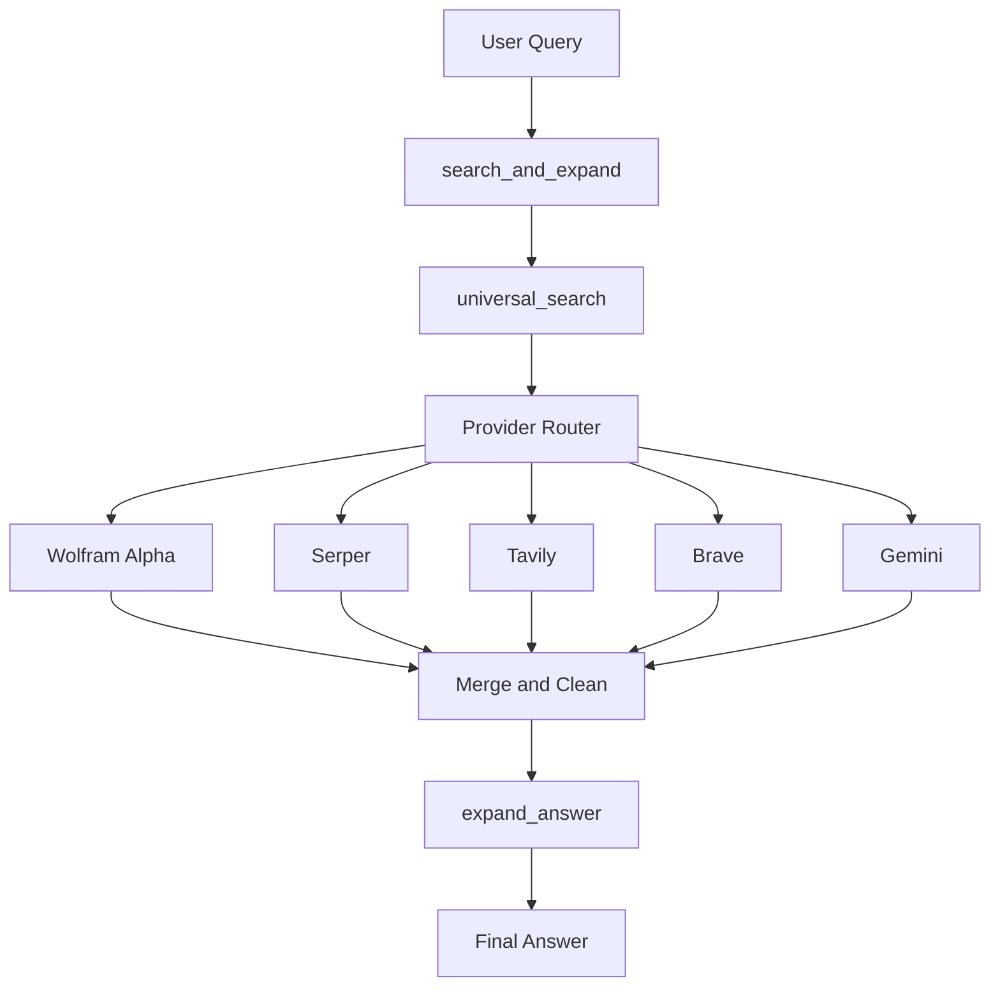

# Universal Search and Expand Bundle

## Overview

Universal Search and Expand is a Gemma Edge Gallery skill bundle that retrieves fresh information from external APIs and turns it into a readable, grounded answer.

The bundle is designed to work well on phones and other resource-constrained devices. It keeps retrieval and expansion separate so the model can first gather context and then rewrite that context into a clearer response.

Use `search_and_expand` as the main entry point. It is the recommended skill for most users because it chains the retrieval and expansion steps for you.

## What the bundle does

The bundle is built around three skills:

1. `search_and_expand`
2. `universal_search`
3. `expand_answer`

Recommended flow:

- `search_and_expand` calls `universal_search`
- `universal_search` calls one or more search APIs and returns dense plain text
- `expand_answer` rewrites that text into a fuller answer

This design is useful when the model alone produces short, generic answers. By separating search from expansion, the bundle gives the model a better starting point for a grounded response.

## Why not just 1 skill?  A walk down the development process 

I orignallly tried just 1 skill.  I separted the concerns into various files.  So much more robust in structure, but not in function.  Slimmed down to the flattest possible format.  Then the problem was Gemma completely ignored the skill instructions.  You can try it yourself and send searches to `universal_search` if you are a glutton for narrated meta summaries.

Next, I tried `expand_answer` to elaborate further.  This worked with a few tweaks, but the narrated voice persisted.  Gemma has a way of inferring intent despite what your explicit instructions may be.

Finally, a 3rd level orchestrator.  This got to the best answers to date.  The drawback is potential accumulated latency along with a much more laborious deployment process.

I'd like to make this more elegant.  Still, a good learning process.

## Skills in this repository

### 1. `search_and_expand`

This is the recommended skill to use.

It orchestrates the workflow and is the user-facing entry point. In normal use, the user only needs to ask one question, and this skill handles the rest.

### 2. `universal_search`

This skill performs the search step.

It supports multiple providers and returns the result as a single dense text block. That output is intentionally simple so the model can use it safely on-device.

### 3. `expand_answer`

This skill performs the rewrite step.

It turns the dense search text into a more readable response, usually with more detail and better flow than the raw search output.

## Architecture overview



## Execution flow

1. The user asks a question.
2. `search_and_expand` is triggered.
3. `search_and_expand` calls `universal_search`.
4. `universal_search` selects a provider or tries providers in order.
5. The provider returns search or knowledge text.
6. The text is cleaned and merged into a dense plain-text block.
7. `expand_answer` rewrites that block into a fuller answer.
8. The final answer is returned.

## Deployment structure

The repository is organized as three skill directories.

```text
skills/
└── universal_search_bundle/
    ├── search_and_expand/
    │   └── SKILL.md
    ├── universal_search/
    │   ├── SKILL.md
    │   └── scripts/
    │       └── index.html
    └── expand_answer/
        ├── SKILL.md
        └── scripts/
            └── index.html
```

## Prerequisites

### Required

- Google AI Edge Gallery
- A Gemma model installed in the app
- At least one supported API key for search or knowledge retrieval

### Recommended

- A Serper API key
- One backup provider key, such as Tavily or Brave
- A Wolfram Alpha API key for math, computation, and factual lookups

## Installation on phone

### Android phone

1. Install Google AI Edge Gallery on your Android device.
2. Open the app and load the Gemma model you want to use.
3. Add the skills from this repository.
4. Make sure the bundle is installed with the skills in this order:
   - `search_and_expand`
   - `universal_search`
   - `expand_answer`
5. Configure API keys in `universal_search/scripts/index.html`.
6. Save the files and refresh or reload the skills in the app.

### Phone-specific notes

- Use `search_and_expand` as the default skill.
- Keep API keys in the configuration block near the top of `universal_search/scripts/index.html`.
- Leave debug mode on only when you are testing.
- Keep the output plain and compact in `universal_search`; let `expand_answer` do the rewriting.

## Installation on desktop or laptop

The bundle is phone-safe, but it can also be used on desktop or laptop through an Android emulator or any supported local build of the Gallery app.

### Option 1: Android emulator

1. Install an Android emulator on your computer.
2. Install Google AI Edge Gallery inside the emulator.
3. Load the Gemma model.
4. Copy the skill bundle into the Gallery skill directory used by the emulator.
5. Refresh the skills list.
6. Open `search_and_expand` and test with a simple query such as `OpenAI`.

### Option 2: Supported desktop build

If you are using a desktop build of AI Edge Gallery or a compatible runtime:

1. Open the skill directory used by that runtime.
2. Copy the three skill folders into the correct location.
3. Confirm that `universal_search/scripts/index.html` is present.
4. Reload the app or restart the runtime.
5. Run a test query.

### Desktop and laptop notes

- Use the same skill order as on phone.
- Verify that API keys are valid before testing.
- Start with a simple query such as `debug` if the debug toggle is enabled.

## Supported search and knowledge providers

The bundle supports multiple providers. In auto mode, `universal_search` can try them in sequence and fall back if one is missing, disabled, or unavailable.

| Provider | Description | Free tier limits | API URL |
| --- | --- | --- | --- |
| Serper | Google Search API wrapper with strong general-purpose web search coverage. | 2,500 free queries; no credit card required. | https://serper.dev/ |
| Tavily | Search API designed for AI retrieval and RAG workflows. | Free for students is advertised; the public pricing page also shows a free plan with 1,000 API credits per month. | https://www.tavily.com/pricing |
| Brave Search | Web search API with web, news, image, and other search results. | Includes $5 in free credits every month. | https://brave.com/search/api/ |
| Wolfram Alpha | Computational knowledge engine for math, science, and factual queries. | Up to 2,000 non-commercial API calls per month. | https://products.wolframalpha.com/api |
| Gemini API | Google developer API for model-based retrieval, grounding, and fallback text generation. | Free tier available; quotas vary by model and tier. | https://ai.google.dev/gemini-api/docs/pricing |

## Recommended provider order

The default order in `universal_search` is designed to balance speed, accuracy, and fallback behavior.

Recommended order:

1. Wolfram Alpha
2. Serper
3. Tavily
4. Brave
5. Gemini

This order works well for mixed queries because Wolfram Alpha is strong for numeric and factual lookups, Serper is fast and broad, Tavily is useful for AI-oriented retrieval, Brave is a good fallback search source, and Gemini can act as a final fallback when needed.

## Configuration

Most user-configurable values are grouped near the top of `universal_search/scripts/index.html`.

Typical configuration values include:

- API keys
- default provider order
- debug toggle
- result limit
- output length limit
- timeout settings

## How to use the bundle

### Recommended usage

Use `search_and_expand` directly.

Example prompts:

- Search and expand for OpenAI
- Search and expand for OpenAI revenue
- Search and expand for 
- Explain quantum computing
- What is the current status of the project?
- Compare Serper and Brave Search APIs

### Advanced usage

You can also test the lower-level skills directly:

- `universal_search` if you want to inspect the raw retrieval output
- `expand_answer` if you want to test the rewrite step on existing text

## Troubleshooting

### The response is too short

- Make sure you are using `search_and_expand`
- Confirm that `expand_answer` is installed
- Verify that the model is actually loading the expansion skill

### No search results appear

- Check that at least one API key is valid
- Make sure the key is not left as the default placeholder value
- Confirm that the selected provider is enabled

### The skill does not run

- Check folder names
- Confirm that `SKILL.md` is in the correct directory
- Confirm that `scripts/index.html` is present for the tool-backed skills
- Reload the app after changing files

### Debug mode is still active

- Set the debug toggle to off in `universal_search/scripts/index.html`
- Save the file and reload the skill
- Personally, I leave it on, just to be able to test to make sure the most basic case is working (i.e., "search for debug").

### Universal Search responses instead of Search and Expand

- Preface your query with Search and Expand

### Responses to the same query may vary

- It's a real time search.  Life moves fast.

## Known Issues

- Searches may sometimes hang.  I think that may be related to phone compute / memory.  Research shows this may be inherent latency from sucessful calls and orchestrating multiple calls.  Could consider firing silmulataneous API calls or setting a global timeout.

## Design principles

- Keep retrieval and expansion separate
- Return a single dense text block from retrieval
- Avoid labels, bullets, and heavy structure in the tool output
- Keep the bundle phone-safe
- Prefer `search_and_expand` for normal use

## Configuration Reference

| Field             | Description                                                                                   | Required                   | Possible Values / Format                                               |
| ----------------- | --------------------------------------------------------------------------------------------- | -------------------------- | ---------------------------------------------------------------------- |
| `SERPER_API_KEY`  | API key for Serper (Google search wrapper). Primary default provider for general web results. | Optional (but recommended) | String (e.g., `"abc123"`). Leave `""` or `"key"` to disable            |
| `TAVILY_API_KEY`  | API key for Tavily search. Provides AI-optimized summarized results.                          | Optional                   | String. Leave empty or `"key"` to disable                              |
| `BRAVE_API_KEY`   | API key for Brave Search API. Independent web index fallback.                                 | Optional                   | String. Leave empty or `"key"` to disable                              |
| `WOLFRAM_API_KEY` | API key for Wolfram Alpha. Best for math, calculations, and factual queries.                  | Optional                   | String. Leave empty or `"key"` to disable                              |
| `GEMINI_API_KEY`  | API key for Gemini API. Used as a fallback LLM-based search provider.                         | Optional                   | String. Leave empty or `"key"` to disable                              |
| `PROVIDER_ORDER`  | Defines the order of search providers used in `auto` mode. First valid result wins.           | Yes                        | Array of strings: `["wolfram", "serper", "tavily", "brave", "gemini"]` |
| `ENABLE_DEBUG`    | Enables debug mode. Allows `"debug"` query to test skill wiring without API calls.            | Optional                   | `true` or `false`                                                      |
| `MAX_RESULTS`     | Maximum number of results fetched per provider (when applicable).                             | Optional                   | Integer (recommended: `3–5`)                                           |
| `MAX_CHARS`       | Maximum length of returned text sent to the model. Controls token usage.                      | Optional                   | Integer (recommended: `800–1500`)                                      |
| `TIMEOUT_MS`      | Timeout for each API request in milliseconds. Prevents hanging calls.                         | Optional                   | Integer (recommended: `3000–5000`)                                     |

## Configuration Notes
- Leaving an API key as "" or "key" automatically disables that provider.
- At least one provider should be configured for meaningful results. You know, so you can actually search for someting.
- Lower MAX_CHARS improves performance on-device but may reduce answer quality.
- PROVIDER_ORDER strongly impacts result quality and latency

## Repository layout

This repository contains three skill directories:

- `search_and_expand`
- `universal_search`
- `expand_answer`

The repository also includes support files such as `.gitignore`, `.nojekyll`, and the license file.

## License

MIT License
